# Diagrama de Arquitetura Corrigido

```mermaid
graph TD
    subgraph UserInteractionLayer ["Camada de Interação do Usuário"]
        UI[AddOns Web UI]
    end

    subgraph CoreApplicationLayer ["Camada da Aplicação Principal"]
        A[AddOns Backend Flask App]
        DB[(PostgreSQL Database)]
    end

    subgraph MessagingInfrastructure ["Infraestrutura de Mensagens"]
        RMQ_C((RabbitMQ Cluster))
        REDIS[(Redis - Results Backend)]
    end

    subgraph MonitoringLayer ["Camada de Monitoramento"]
        MONITOR[Monitoring & Logging System]
        LOG_DB[(Logs Database)]
    end

    subgraph CeleryWorkerLayer ["Camada de Workers Celery"]
        C_AD[Celery Workers AddOns]
        C_M[Celery Workers Mail Sender]
        C_P[Celery Workers Protokols.bot RPA]
        C_ADM[Celery Workers Administrativo.bot RPA]
        C_AC[Celery Workers Academico.bot RPA]
        C_RH[Celery Workers RH.bot RPA]
        C_AFT[Celery Workers AFT.bot RPA]
        C_SIA[Celery Workers SIAFI.bot RPA]
        C_CON[Celery Workers Contratos.bot RPA]
        C_COM[Celery Workers Comprasnet.bot RPA]
    end

    subgraph ExternalSystems ["Sistemas Externos"]
        ES_P(Sistema Protocolo Interno)
        ES_ADM(Sistema Administrativo Interno)
        ES_ACA(Sistema Acadêmico Interno)
        ES_RH(Sistema RH Interno)
        ES_AFT(Sistema Governo AFT)
        ES_SIA(Sistema Governo SIAFI)
        ES_CON(Sistema Governo Contratos)
        ES_COM(Sistema Governo Comprasnet)
        SMTP[SMTP Server External]
    end

    subgraph ErrorHandling ["Tratamento de Erros"]
        DLQ[Dead Letter Queue]
        RETRY[Retry Mechanism]
    end

    %% Conexões da UI
    UI -- "HTTP/S" --> A

    %% Conexões da Aplicação Principal
    A -- "Read/Write" --> DB
    A -- "Enqueue Tasks (Producer)" --> RMQ_C
    A -- "Store/Retrieve Results" --> REDIS

    %% Conexões do RabbitMQ para Workers
    RMQ_C -- "Consume addons_general_tasks" --> C_AD
    RMQ_C -- "Consume mail_send_queue" --> C_M
    RMQ_C -- "Consume protokols_queue" --> C_P
    RMQ_C -- "Consume administrativo_queue" --> C_ADM
    RMQ_C -- "Consume academico_queue" --> C_AC
    RMQ_C -- "Consume rh_queue" --> C_RH
    RMQ_C -- "Consume aft_queue" --> C_AFT
    RMQ_C -- "Consume siafi_queue" --> C_SIA
    RMQ_C -- "Consume contratos_queue" --> C_CON
    RMQ_C -- "Consume comprasnet_queue" --> C_COM

    %% Conexões dos Workers
    C_AD -- "Internal Logic / DB Operations" --> DB
    C_AD -- "Store Results" --> REDIS
    C_AD -- "Enqueue Chained Tasks" --> RMQ_C

    C_M -- "Send Email" --> SMTP
    C_M -- "Store Results" --> REDIS

    %% Workers RPA - Interação com Sistemas Externos
    C_P -- "RPA Automation" --> ES_P
    C_P -- "Store Results" --> REDIS
    C_P -- "Enqueue Follow-up Tasks" --> RMQ_C

    C_ADM -- "RPA Automation" --> ES_ADM
    C_ADM -- "Store Results" --> REDIS
    C_ADM -- "Enqueue Follow-up Tasks" --> RMQ_C

    C_AC -- "RPA Automation" --> ES_ACA
    C_AC -- "Store Results" --> REDIS
    C_AC -- "Enqueue Follow-up Tasks" --> RMQ_C

    C_RH -- "RPA Automation" --> ES_RH
    C_RH -- "Store Results" --> REDIS
    C_RH -- "Enqueue Follow-up Tasks" --> RMQ_C

    C_AFT -- "RPA Automation" --> ES_AFT
    C_AFT -- "Store Results" --> REDIS
    C_AFT -- "Enqueue Follow-up Tasks" --> RMQ_C

    C_SIA -- "RPA Automation" --> ES_SIA
    C_SIA -- "Store Results" --> REDIS
    C_SIA -- "Enqueue Follow-up Tasks" --> RMQ_C

    C_CON -- "RPA Automation" --> ES_CON
    C_CON -- "Store Results" --> REDIS
    C_CON -- "Enqueue Follow-up Tasks" --> RMQ_C

    C_COM -- "RPA Automation" --> ES_COM
    C_COM -- "Store Results" --> REDIS
    C_COM -- "Enqueue Follow-up Tasks" --> RMQ_C

    %% Tratamento de Erros
    RMQ_C -- "Failed Tasks" --> DLQ
    DLQ -- "Retry Logic" --> RETRY
    RETRY -- "Requeue Tasks" --> RMQ_C

    %% Monitoramento
    C_AD -- "Send Logs" --> MONITOR
    C_M -- "Send Logs" --> MONITOR
    C_P -- "Send Logs" --> MONITOR
    C_ADM -- "Send Logs" --> MONITOR
    C_AC -- "Send Logs" --> MONITOR
    C_RH -- "Send Logs" --> MONITOR
    C_AFT -- "Send Logs" --> MONITOR
    C_SIA -- "Send Logs" --> MONITOR
    C_CON -- "Send Logs" --> MONITOR
    C_COM -- "Send Logs" --> MONITOR

    MONITOR -- "Store Logs" --> LOG_DB
    A -- "Query Logs" --> LOG_DB

    %% Estilos
    classDef userLayer fill:#e1f5fe
    classDef coreLayer fill:#f3e5f5
    classDef messagingLayer fill:#fff3e0
    classDef workerLayer fill:#e8f5e8
    classDef externalLayer fill:#fce4ec
    classDef monitoringLayer fill:#f1f8e9
    classDef errorLayer fill:#ffebee

    class UI userLayer
    class A,DB coreLayer
    class RMQ_C,REDIS messagingLayer
    class C_AD,C_M,C_P,C_ADM,C_AC,C_RH,C_AFT,C_SIA,C_CON,C_COM workerLayer
    class ES_P,ES_ADM,ES_ACA,ES_RH,ES_AFT,ES_SIA,ES_CON,ES_COM,SMTP externalLayer
    class MONITOR,LOG_DB monitoringLayer
    class DLQ,RETRY errorLayer
```

## Principais Correções Implementadas:

### 1. **Adicionado Redis como Backend de Resultados**
- Separado do RabbitMQ para armazenar resultados das tarefas
- Conexões adequadas para store/retrieve de resultados

### 2. **Simplificada Arquitetura de Bots**
- Removida duplicação entre Workers e Bot Logic
- Workers Celery contêm toda a lógica RPA
- Interação direta com sistemas externos

### 3. **Adicionada Camada de Monitoramento**
- Sistema de logs centralizado
- Database dedicado para logs
- Conexões de todos os workers para monitoramento

### 4. **Implementado Tratamento de Erros**
- Dead Letter Queue para tarefas falhadas
- Mecanismo de retry
- Fluxo de reprocessamento

### 5. **Melhorado Fluxo de Dados**
- Fluxo bidirecional claro
- Resultados retornando via Redis
- Logs centralizados

### 6. **Adicionados Estilos Visuais**
- Cores diferentes para cada camada
- Melhor organização visual
- Identificação clara de responsabilidades

Esta arquitetura corrigida é mais robusta, escalável e adequada para implementação em produção.